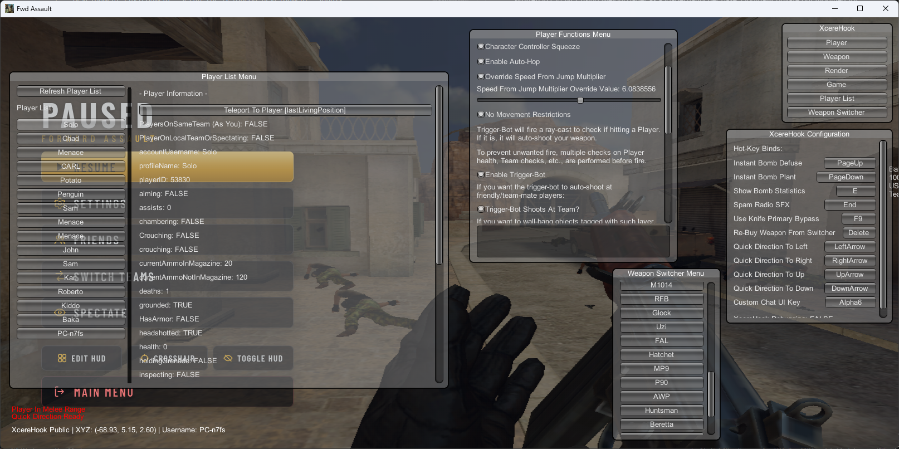

# XcereHook Public
> MelonLoader Cheat for Forward Assault (Steam-Build)

Written in C#/.NET using MelonLoader as a loader/launcher base. Originally
private but modified for public release. Certain features missing on
purpose (originally private). You'll need to provide your own
development environment, setup for MelonMod development, supply
correct references, etc.

No support provided, not liable for bans, etc, etc. I don't play this game
anymore and I don't care about cheat base being public (except for couple
private functions I wanna keep hidden for lolz).

---

Cheat Menu Preview:

---

You can download a final build DLL for the game in the Releases section
on this repository. You'll need MelonLoader installed on the game
and have ran the game at-least once before and after installing ML.

Recommended to use a VPN when using XH. Certain functions (such as shooting
grenades from weapon) cause match-bans (temporary IP-based lobby bans)
due to RPC-call abuse.

# Features
> List of features included with risk awareness ratings.

- Player
  - Fly Hack (Will match-ban/IP lobby ban if abused)
  - No Fall Damage Penalty
  - Character Controller Squeeze (Allows walking into compact areas.)
  - Enable Auto-Hop (Bunnyhopping)
  - Override Speed From Jump Multiplier (Will match-ban/IP lobby ban too high.)
  - No Movement Restrictions (Walk before match start count-down timer.)
  - Trigger-Bot
    - Trigger-Bot Shoot At Team
    - Trigger-Bot Wall-Bang (Objects marked in Unity as Wallbang layer.)
    - Trigger-Bot Wall-Bang Extended (Wall-bang capable objects not marked as such in Unity.)
  - Auto-Knife Bot (Detect Player<->Enemy distance on server-side and auto-knife.)
    - Knife Bot Dot Estimation (Attempts to only back-stab using Dot calculation.)
  - Quick Direction (Use arrow keys to make quick movement changes. Makes it easier to go out-of-bounds on purpose.)
    - Quick Direction To Safety (Poor man's anti-aim by side-moving on hit if certain parameters are met.)
  - Enable Radio SFX Spamming (Spam defuse/plant SFX on server-side RPC. Uses internal delay to prevent lobby ban and RPC-abuse flags.)
  - Visual Spin-Bot (Private; Not available in Public builds.)
- Weapon
  - Allow Scope On All Weapon Types (Allows scoping in a FAL, AK47, etc.)
  - Modify Weapon Bullet Penetration (Not sure if this is client-sided.)
  - Decrease Aim Recoil, Camera Recoil, Weapon Spread, Bobbing/Kicking...
  - Weapon Can Shoot Grenades (Will match-ban if abused.)
    - Can shoot Frag, Smoke, Flashbang, and Incendiary depending on config.
  - Treat Knife As Primary Weapon (Bypass attempt to allow dropping knives to other players.)
- Render
  - Do Not Fade Player Dot On Mini-Map (Radar ESP)
  - Disable Flashbang Effects
  - Draw 2D Player Name Tag ESP (BulletForceESP fork ported to FA.)
    - Draw Player Name, Health, Held Weapon, and Team status.
  - Show Bomb Statistics
- Game
  - Disable ACTk (Overrides ACTk functions in the attempt to break code-base.)
  - Disable Client-Sided Anti-Hack Functions
  - Instant Bomb Defuse On Key
  - Instant Bomb Plant On Key
  - Allow Planting Bomb Anywhere On Map
  - Uncap FPS - Allow Past 240 FPS (Enabled by default. Same with ACTk/AH functions.)
  - Buy Menu - Allow Buying Generic (Not sure if this does anything.)
  - Buy Zone - Remove Zone Restrictions (Allows you to re-open buy menu anywhere on map. However, if buy-timer expires, it won't let you open buy menu.)
  - Send Fake SyncVar Values (Private; Not available in Public builds.)
  - Use Custom Chat UI
- Player List
  - Allows you to view all Players in a lobby, teleport to them, selecting your Player will allow you to teleport yourself to the top of the map, Bomb Site A/B, selecting any player or yourself will let you view player-data, etc.
- Weapon Switcher
  - Allows switching your weapon to any weapon available in-game. This includes swapping primary/secondary weapons and knives. Also allows giving yourself grenades.

Also includes key-bind configuration for certain functions. No load/save system exists as I didn't get that far into development before I got bored of the game. You get tired of making Steam accounts when developing cheats and receiving bans...

Includes a menu system letting you open certain cheat areas such as Player, Game, Render, etc. Allows you to drag said windows around. See preview above for information. Access menu using the Insert key by default.

---

As of 9/25/2026, all cheat features are working, unpatched, and not detected by the game (as-in, not resulting in an instant-account ban.)

Abusing certain cheat features will cause an IP ban disallowing you from joining the same match/lobby, or, in some cases, any lobby for X amount of time. Easily bypassable using a VPN. No features are causing account-wide bans at the time stamped above.